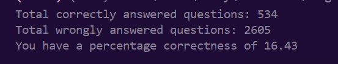
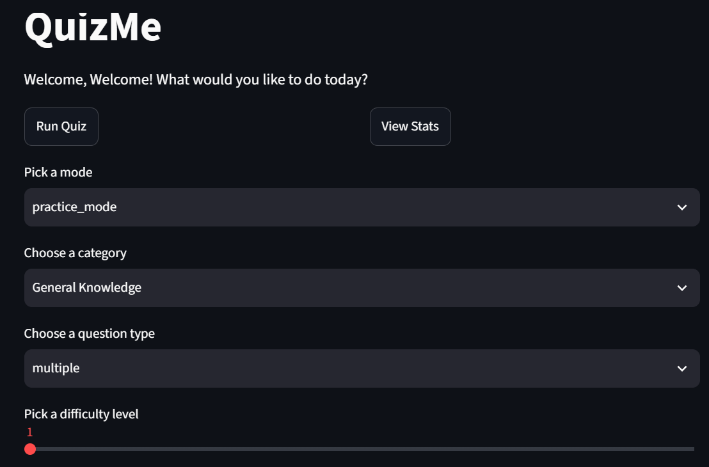
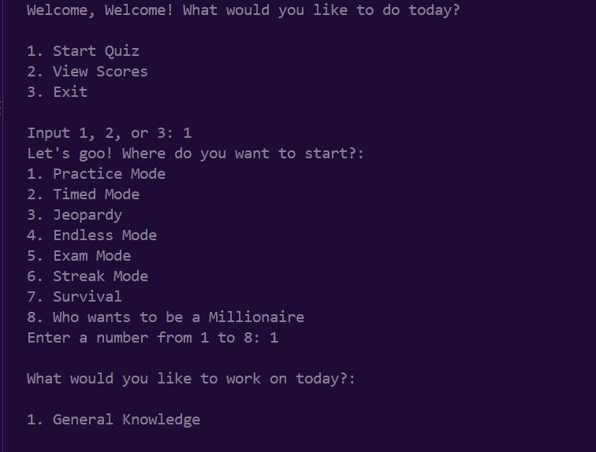

# QUIZME 

(until I find a better name)

Basically quizzes in the form of different game modes :) Fun and educative :)

ngl I learned a lot from running this code countless times :) e.g. that this train station is in Wales :)

So, yes, fun and educative. Play QuizMe todayyy!!! :)) Also, more motivation: Beat my stats :)

## Streamlit UI

## Terminal :)

You can run my app three ways:
- Terminal
- Streamlit UI in your browser.
- Streamlit website on app https://quiz-master-q2evebp8vev9djubrrgzjy.streamlit.app/
  (Do this - )

### How to run:
- Clone the repo
- Create a venv (if u want to)
- Run "pip install -r requirements.txt"
- Run code with:
  - Terminal: run "python main.py"
  - Streamlit: run "streamlit run app.py"

Quiz has a couple of (functioning) modes:
These ones are the most useful.

- Practice Mode (just solve a random number of questions)
- Timed Mode (Solve questions in a limited amount of time)
- Jeopardy Mode, and (Make sure you don't get below 0, then try to beat your last score.)
- Endless Mode (Keep solving until you're tired)

TECH STACK:
- Python
- Streamlit UI
- Open Trivia Database API and QuizAPI
- JSON...?

Gonna come back and rebuild this as a web app with Flask/Django!