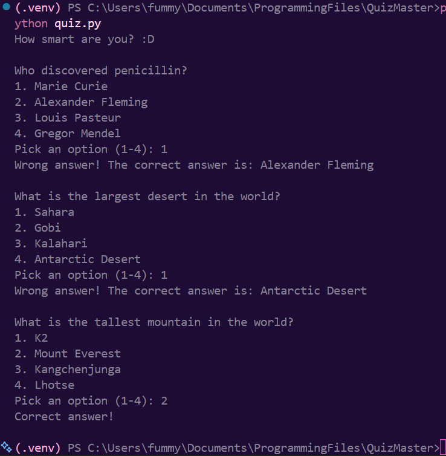
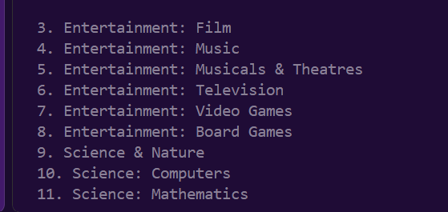
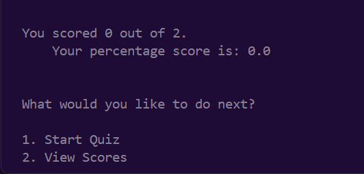
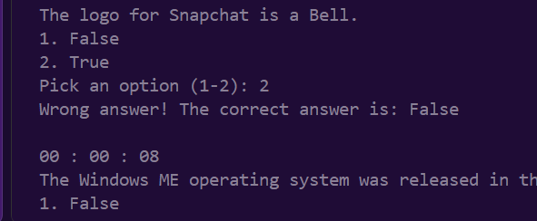
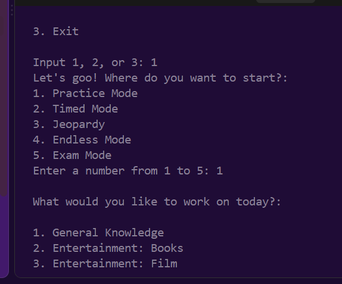
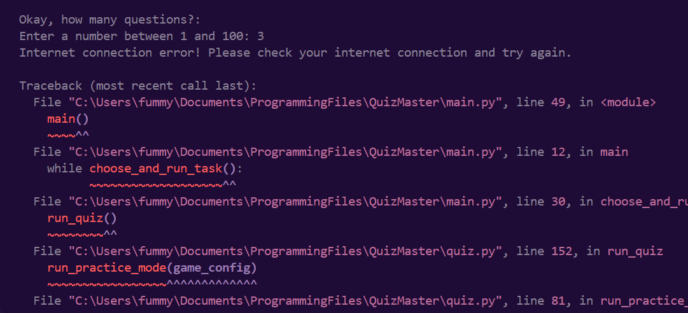
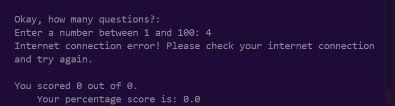
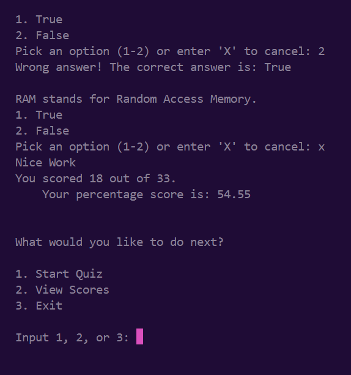
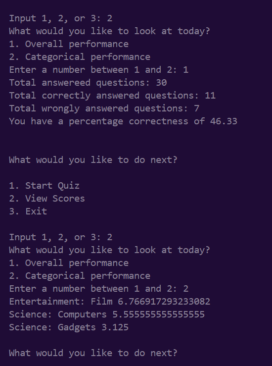
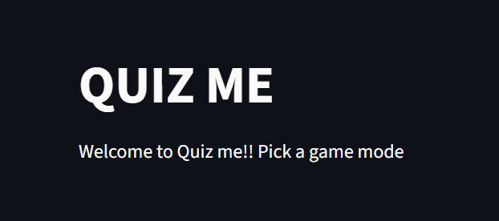

questions.json and questions.py done.
Tested and functioning properly

quiz.py done.
Tested and functioning

score.py done
Tested and functioninggg

integrated w Open Trivia DB API calls.
Tested and functioning

---

1st Aug

So, we can now pick our category, difficulty level, question type and number of questions.

I'm gonna try to implement picking more than 1 category. 
And then after that, I'm going to make a full loop -- so that it goes back and allows the user to play again until the suer clicks exit.

Acc, I'll prolly do the second one first.

After it all, I'll do streamlit integration, ship, and then do UI with either Flask/Django, make it to a full webapp.

Be back in the evening! let's just say I wasn't trying on the last quiz run :P

---

I asked AI what else to implement, and it gave me an entitre list. I do wanna practice a lot w Python, so I'll probably acc try to add a lot of them.

So, I'll add different quiz styles.
A user can just do one where they just want to solve problems
like test prep more or less.

i'll also add timed quizzes

game mode - maybe from easy to medium, to hard. acc, I'll see what kindof tv show game or sumn we can simulate. or maybe jeopardy or sumn.

Just keep solving.

maybe one where they can go back to questions - so like test/exam simulation.

So, that makes 5!
- Test Prep/Practice
- Timed quizzes
- Game Mode (call it sumn) Maybe jeopardy style??
- Exam Mode!
- Addicted/Endless mode

ALSO TO IMPLEMENT
- Store scores and attempted quiz data so that we can implement stats!
- Allow pick mutiple categories.

instead if just score, store the topic it was under, number of questions...

and we'll be able to do stats. best score, best topic, performance under a particular topic. average score under particular topics.

for test prep (normal) - they'll pick their questions, answer them, and then  there'll be  a table to show what they missed at the end in addition to naswers being shown as they solve them

timed quiz would be a timer, and would also be the same review of answers a the end.

maybe once i do streamlit stuff, i'll add different users and habe them be displayed with their stats??

---

2nd Aug (12am btw)

Turns out the way to implement the timer inteh CLI is just checking after each question, so the user can finish answering one more question even tho the timer just ended. there's a way to interrupt which I will attempt in the morning. i'll implement better stuff when we switch to GUI!

---

3rn Aug (12.38am)
Did not later try the interrupt thingy but I researched a bit how to do it.
Trying to work on integrating the new game modes, and I have to restructure my code to make functions accomodate my modes... like be reusable, so I don't just make a new function for each mode.
It's 12.38am! I'll continue tmr!

---

3rd Aug (11.27 pm)
Yh, so at this point, I'm doing a lot of asking chat GPT and checking, trying to refactor the code especially defining a dic for the configurations, so i'm not doing 10000 if statements in each function... if you get! I think I finally got it now tbh, but need to go sleep! will continue tmr.

anyways, I currently have the and I'm trying to create separate parent functions for each of the game modes and mdivide most of the already existing functions into more specific individual functions, e.g configure_category, configure_difficulty, instead of doing all 4 in one function.

---
4th August (11.45pm)

RAHH! Did my victory dance today!! I was able to understand what I needed to change lol and refactor the functions (making more dedicated ones and also passing variables differently) and get everything working again.

I've worked on the practice mode and it comes together fine. I haven't finished integrating the timed_mode (that is after I made changes to my code var and stuff), and then I haven't started working on the other 3 modes. I'll start from there tmr.

I also did error handling for the API call (partially bcuz T-mobile and Verizon has been showing our area what Nigerians like to call 'pepper', and so I had an error cuz i wasn't connected to the internet and I decidedd to research exception handling and fix the code to print pleasnt stuff instead of the lengthy error codes)

It worked, but raised zero division error in my scoring system. will pick up from there tmr.

---
^^^fixed

Yayay! I ensured Timed Mode worked and integrated Endless Mode. it works.. finallyy! So, I found out the Open Trivia DB's limit is 16 questions per call????? Just 16?? So, I had to change my endless mode logic to accomodate 16. it works, but the only thing is I get dupl,icate questions (for Computer Science, Easy, True/False) which is annoying. So, I may check QuizAPI or other APIs. but this works for just testing as I build. yipee. t-tmr

--- 

7th Aug (3am)

I'm tireedd! Started around 10 last night. So, I was thinking of what game style to implement for the jeopardy, and when I asked chatgpt it actually said, do these 5 different game styles... like what??
So, I ended up pickinf survuvor mode (you have 3 lives,a dn a given number of questions), jeopardy (if you fail it, the number of points is deducted, if you win it, it's added) streak mode(fail a question, and streak restes, but you still continue), who wants to be a millionaire (if you fail, game over, lol) but points keep adding up if you don't.

then i needed to implement different modes showing up for some of the modes, and i genuinely got tire/bored so i moved to do stats, and i had to change my helper functions and stuff to show stats,a dn then go back and change the functiions that use them..

did that, went somewhere and this code is defo buggy rn. but do I care by 3 am in the morning? not really! gooof night.

--- 
7th Aug (10pm)

So, I have the whole storage stuff working well. Hopefully I will not have the concerns of too much info in the scores_data.json. (that'll be like if I play 1million games maybe)

but tbh, after a while, I shud likely switch to a database, as AI saidd!

Anyways, I fixed the game modes (except 2) that I haven't even started implementing. Only thing is I have to do a couple more things for some of the games, but I want to get displaying stats working this night, and then.... i'll come back to that b4 streamlit.

I've been supposed to do streamlit for like days now. Anyways, 10 min break. i shall be backkk!

---
8th Aug (3am)

Implementing stats display so users can see what they did well in each category, and also thir overall averages and scores.
Will finish up tmr, and then try my best to finish up additional features for other modes, and we SHALLLL move onto UI

---

9th Aug (11pm)
Went somewhere, acc in stats display!
Need to sort the stats I store so I can get the highest 5 and lowest 5 categories. a bit tiring cz I have a dictionary of lists of dictionaries. I shud be done tmr :( crying face emojiii

---

10th Ausust
Okay, if i don't finish stats display, idc againn!! alr, lock in

---
11th August (12.27am)

I completed display stats -- for the most part (crying face emoji lolol)
Basically, there's stuff wrong with my dicts logic but I'm gonna get to this till tmr cuz it's alr 12.30am. but i'm SUREEEE that i shud start streamlit tmr. The user can view overall questions wrong, and percentage avg. and also categorical based questions worng and percentage avg
Mind you, I have 2 inomplete game modes, but I'll get back to that, dw!

---

11th Aug (11.56pm)

It worksss! The issue was with the way I was calling itt. Brain is fried, but I really wanna start UI before I go to bed, even tho I really wannan sleep early.

let's get to it.

---

Yayay. So, I Researched a couple things and just tested the basic out. I should strat actually transforming code tmr. I think i might clone this repo, incase i mess anything up but wtvver
